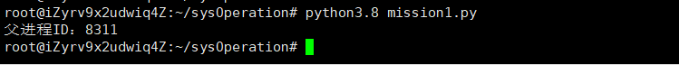
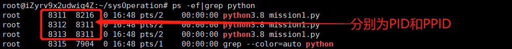
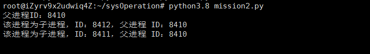
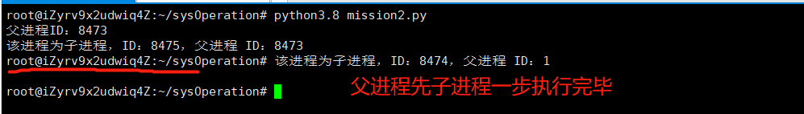
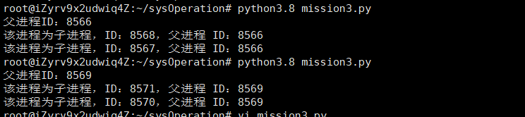
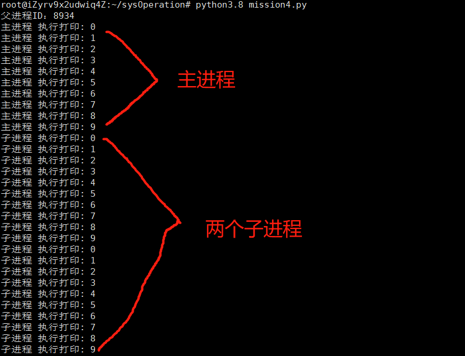
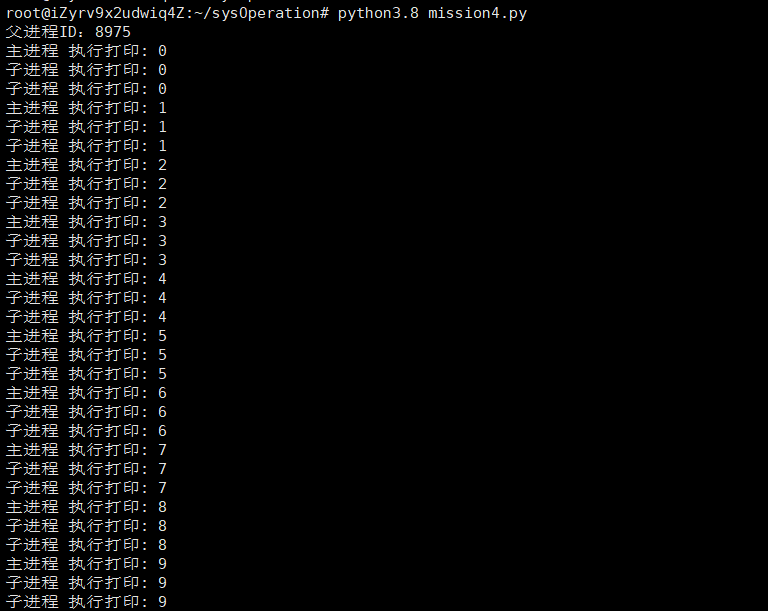
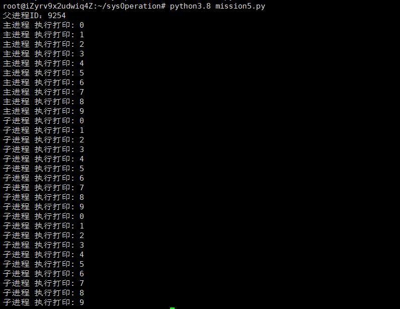
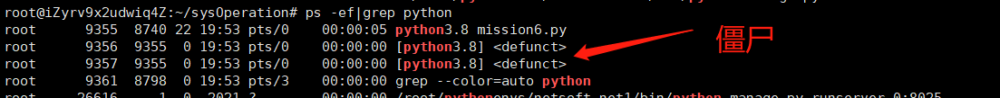

## 实验1：进程管理
在本次实验中，我采用 Python 来完成所有的实验点。

实验中的要求与指导参照实验模板。

所有的代码将会在对应 ex 的 code 目录

## 一、实验目的与要求
1.	熟悉 Linux 系统编程的方法，熟悉系统调用的编程能力，了解命令解释程序的基本原理和实现方法。
2.	使用 fork 命令进行进程的创建。
3.	认识和了解并发执行的实质。
4.	分析进程争用资源的现象，使用 lock 函数来实现进程互斥

## 二、实验原理与内容
每个 Python 程序在执行时，系统都会生成一个新的进程，该进程又称父进程（或主进程）。在此基础上，Python 的 os 模块还提供有 fork() 函数，该函数可以在当前程序中再创建出一个进程（又称子进程）。也就是说，程序中通过引入 os 模块，并调用其提供的 fork() 函数，程序中会拥有多个进程，其中父进程负责执行整个程序代码，而通过 fork() 函数创建出的子进程，会从创建位置开始，执行后续所有的程序（包含创建子进程的代码）。

**实验任务 1**：在 main 父进程中创建两个子进程，两个子进程不编写自己的代码，运行查看效果。
**实验任务 2**：在 main 父进程创建两个子进程，分别输出两个子进程与父进程的ID 号。
**实验任务 3**：在任务2的基础上，在父进程中共设置 wait 函数，等待子进程结束，分别对比与任务2的结果有什么区别，并进行分析。
**实验任务 4**：在main 父进程创建两个子进程，分别在父进程与子进程设置循环输出，查看运行结果，并分析原因。
**实验任务 5**：在任务4的基础上，使用lockf函数进行资源锁定。
**实验任务 6**：在父进程中设置一个死循环，通过Linux 命令的查看进程命令，检查子进程是否变成僵尸进程。

## 三、实验设备与软件环境

Ubuntu 1804、Python3.8

## 四、实验过程与结果

### 4.1 实验任务1

**在main 父进程中创建两个子进程，两个子进程不编写自己的代码，运行查看效果**。代码及运行结果如下所示（在这个代码中有一点需要注意的是，第一个子进程创建后已经开始向下执行代码，如果不加以限制，那么第二个 fork 的时候，第一个子进程又会新建一个子进程，从而变成四个进程）。

```python
"""
任务1： 在 main 父进程创建两个子进程，两个子进程不编写代码，运行并查看效果
"""

import os
import time

parent = os.getpid()
print(f"父进程ID：{parent}")


# 创建子进程1
os.fork()

if os.getpid() == parent:  # 限定只有主进程才能创建子进程
    os.fork()  # 创建子进程2

time.sleep(20)

```




从图中，可以看到父进程的 PID 被打印，此时已经创建了两个子进程，但仅停留在创建的阶段，并未做任何事。为了更好地观察进程的状态，在代码末尾中加入了**sleep**函数，**sleep** 的时候使用 **“ps –ef|grep python”** 命令查看目标进程。状态如下所示。




### 4.2 实验任务2

在 main 父进程创建两个子进程，分别输出两个子进程与父进程的ID 号。代码与运行结果分别如下所示。

```python
"""
任务2： 在 main 父进程创建两个子进程，分别输出两个子进程与父进程的ID 号
"""

import os
import time

parent = os.getpid()
print(f"父进程ID：{parent}")


# 创建子进程1
os.fork()

if os.getpid() == parent:  # 限定只有主进程才能创建子进程
    os.fork()  # 创建子进程2

# 输出子进程的 ID 号及其父进程 ID 号
pid = os.getpid()
if pid != parent:
    print(f"该进程为子进程，ID：{pid}，父进程 ID：{os.getppid()}")

```



### 4.3 实验任务3

**在任务2的基础上，在父进程中共设置 wait 函数，等待子进程结束，分别对比与任务2的结果有什么区别，并进行分析**。

在进行任务3之前，需要清除任务2的sleep函数，以获取最自然状态下的输出。运行后得到下图的结果：



在这个结果的红线部分中，terminal 已经接管了资源，明显父进程（或主进程）已经执行完毕，**但在之后，仍然有子进程 8474 执行了打印**。也就是说，此时父进程先子进程一步结束。

接下来在代码中加入等待函数，如下：

```python
"""
任务3：在任务2的基础上，在父进程中共设置 wait 函数，等待子进程结束，
分别对比与任务2的结果有什么区别，并进行分析。
"""

import os
import time

parent = os.getpid()
print(f"父进程ID：{parent}")


# 创建子进程1
os.fork()

if os.getpid() == parent:  # 限定只有主进程才能创建子进程
    os.fork()  # 创建子进程2

# 输出子进程的 ID 号及其父进程 ID 号
pid = os.getpid()
if pid != parent:
    print(f"该进程为子进程，ID：{pid}，父进程 ID：{os.getppid()}")

if pid == parent:  # 守护进程
    os.wait()

```

运行两次的结果如下图所示：



**很显然，守护与不守护的差异就在于子进程是否会出现在父进程结束后执行的情况了**。

在这里做出一个小总结：主进程在创建出子进程后，由于进程的执行是随机的，所以很大概率会出现主进程，也就是父进程比子进程先执行完毕的情况，这个时候需要守护进程来等待所有子进程的完成。


### 4.4 实验任务4

**在main 父进程创建两个子进程，分别在父进程与子进程设置循环输出，查看运行结果，并分析原因**。

编写代码并运行（为了更好观测，这里只打印0-9的数字）如下：

```python
"""
任务4：在main 父进程创建两个子进程，分别在父进程与子进程设置循环输出，查看运行结果，并分析原因
"""

import os
import time

parent = os.getpid()
print(f"父进程ID：{parent}")


# 创建子进程1
os.fork()

if os.getpid() == parent:  # 限定只有主进程才能创建子进程
    os.fork()  # 创建子进程2

# 设置 name 标识，区分父子进程
name = "主进程" if os.getpid() == parent else "子进程"

# 设置循环，该循环三个进程都会执行

for i in range(10):
    print(f"{name} 执行打印: {i}")

# 守护进程
pid = os.getpid()

if pid == parent:
    os.wait()
```

运行结果：



这样的结果合理，但不是我们实验想要的结果。按照预想的情况，进程是交替运行的，为什么会如此整齐以至于子进程完全没有掺插到主进程的运行期中呢？很简单，对于程序来说，打印 0-9 乃至是 0-49 都是极快的，在交替到下一个进程之前几乎不可能完成不了。

那么为了更加贴合实验，我们在代码中加入sleep函数，修改如下区域代码：

```python
# 设置循环，该循环三个进程都会执行

for i in range(10):
	time.sleep(1)  # 在此处 sleep
    print(f"{name} 执行打印: {i}")
```

代码修改后运行结果如下：



如此便是实验想要的答案。原因如上面所说，正是进程交替运行的产生的影响。在父进程sleep期间，不再提交 IO 请求，那么闲置的硬件资源便可以交由子进程来使用。

### 4.5 实验任务5

**在任务4的基础上，使用lockf函数进行资源锁定**。

修改代码，使每个进程在进入循环期间进行资源锁定，如下：

```python
"""
任务5：在任务4的基础上，使用lockf函数进行资源锁定
"""

import os
import time
from multiprocessing import Lock

parent = os.getpid()
print(f"父进程ID：{parent}")

# 锁对象
lock = Lock()

# 创建子进程1
os.fork()

if os.getpid() == parent:  # 限定只有主进程才能创建子进程
    os.fork()  # 创建子进程2

# 设置 name 标识，区分父子进程
name = "主进程" if os.getpid() == parent else "子进程"

# 设置循环，该循环三个进程都会执行

def task(name, locker):
    locker.acquire()  # 资源锁定

    for i in range(10):
        time.sleep(1)  # 停1秒，以观测
        print(f"{name} 执行打印: {i}")
    locker.release()  # 资源释放

task(name=name, locker=lock)

# 守护进程
pid = os.getpid()

if pid == parent:
    os.wait()


```

得到相应结果（不再赘述）： 



### 4.6 实验任务6

 **在父进程中设置一个死循环，通过Linux 命令的查看进程命令，检查子进程是否变成僵尸进程**。

在这个任务中，探究的主体是子进程是否变成僵尸进程，因此将代码简化，如下：

```python
"""
任务6：在父进程中设置一个死循环，通过Linux 命令的查看进程命令，检查子进程是否变成僵尸进程
"""

import os
import time

parent = os.getpid()
print(f"父进程ID：{parent}")


# 创建子进程1
os.fork()

if os.getpid() == parent:  # 限定只有主进程才能创建子进程
    os.fork()  # 创建子进程2

time.sleep(20)  # 每个进程都停止20秒以观测

# 给父进程设置死循环
pid = os.getpid()
if pid == parent:
    while 1:
        pass
    os.wait()

```

仍然使用1-1 中提及的命令，得到结果如下：



事实如此，已成僵尸进程。


## 五、操作异常问题和解决方案

无

## 六、实验总结（自动生成）

通过这次进程的管理我收获了很多，一方面学习到了许多以前没学过的进程的管理的应用，另一方面还提高了自己动手做项目的能力。本次实训，是对我能力的进一步锻炼，也是一种考验。从中获得的诸多收获，也是很可贵的，是非常有意义的。在实训中我学到了许多新的知识。是一个让我把书本上的理论知识运用于实践中的好机会，原来，学的时候感叹学的内容太难懂，现在想来，有些其实并不难，关键在于理解。在这次实训中还锻炼了我其他方面的能力，提高了我的进程管理综合素质。首先，它锻炼了我做 进程管理 的能力，提高了独立思考问题、自己动手操作的能力，在进程的管理的过程中，掌握了一些进程的管理应用知识的技巧等。

