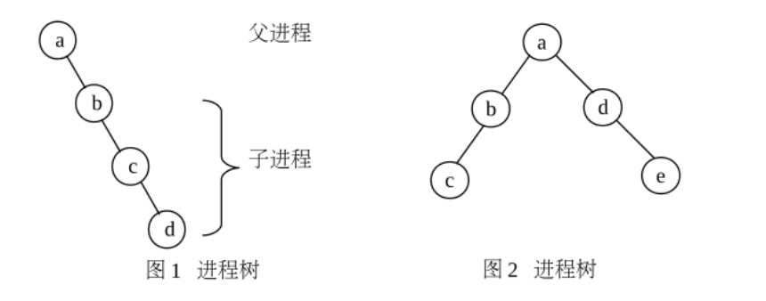

# Ex1

进程管理

## 任务一

编写一段程序，使用系统调用fork()创建两个子进程，在系统中有一个父进程和两个子进程活动。 让每个进程在屏幕上显示一个字符； 父进程显示字符〝a〞，子进程分别显示宇符“b〞和〝c〞。 试观察记录屏幕上的显示结果，并分析原因。

* 代码：参见[m1.c](m1.c)

* 运行结果

```log
parallels@ubuntu-linux-20-04-desktop:~/Downloads/proc_mg$ ./m1
aparallels@ubuntu-linux-20-04-desktop:~/Downloads/proc_mg$ cb
parallels@ubuntu-linux-20-04-desktop:~/Downloads/proc_mg$ 
```

## 任务二

修改已编写的程序，将每个进程的输出由单个宇符改为一句话，再观察程序执行时屏幕上出现的现象，并分析其原因。（必做题）

* 代码：参见[m2.c](m2.c)

* 运行结果

```log
parallels@ubuntu-linux-20-04-desktop:~/Downloads/proc_mg$ ./m2 
a no kotoba
parallels@ubuntu-linux-20-04-desktop:~/Downloads/proc_mg$ c no kotoba
b no kotoba

parallels@ubuntu-linux-20-04-desktop:~/Downloads/proc_mg$ 
```

## 任务三



编写程序创建进程树如图1和图2所示，在每个进程中显示当前进程识别码和父进程识别码。（必做题）

### 图1

* 代码：参见[m3_1.c](m3_1.c)

* 运行结果

```log
parallels@ubuntu-linux-20-04-desktop:~/Downloads/proc_mg$ ./m3_1
a pid: 120347, parent pid: 77395
b pid: 120348, parent pid: 120347
c pid: 120349, parent pid: 120348
d pid: 120350, parent pid: 120349
parallels@ubuntu-linux-20-04-desktop:~/Downloads/proc_mg$ 
```

### 图2

* 代码：参见[m3_2.c](m3_2.c)

* 运行结果

```log
parallels@ubuntu-linux-20-04-desktop:~/Downloads/proc_mg$ ./m3_2 
a pid: 120014, parent pid: 77395
b pid: 120015, parent pid: 120014
d pid: 120016, parent pid: 120014
e pid: 120017, parent pid: 120016
c pid: 120018, parent pid: 120015
parallels@ubuntu-linux-20-04-desktop:~/Downloads/proc_mg$ 
```

## 思考题

1. 系统是怎样创建进程的？

* 在**bash**中启动程序时，以**bash**为**父进程**创建**主进程**
* 在**进程**中调用fork创建进程时，以**当前进程**为**父进程**创建**子进程**，但当父进程提前于子进程结束时，子进程的父进程会更换为init进程。

2. 当首次调用新创建进程时，其入口在哪里？

```
main函数
```

3. 当前运行的程序（主进程）的父进程是什么？

```
bash
```
